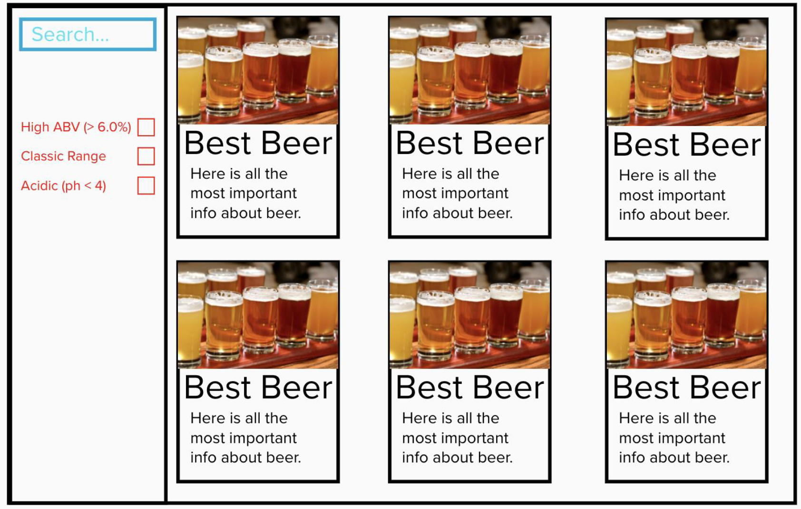
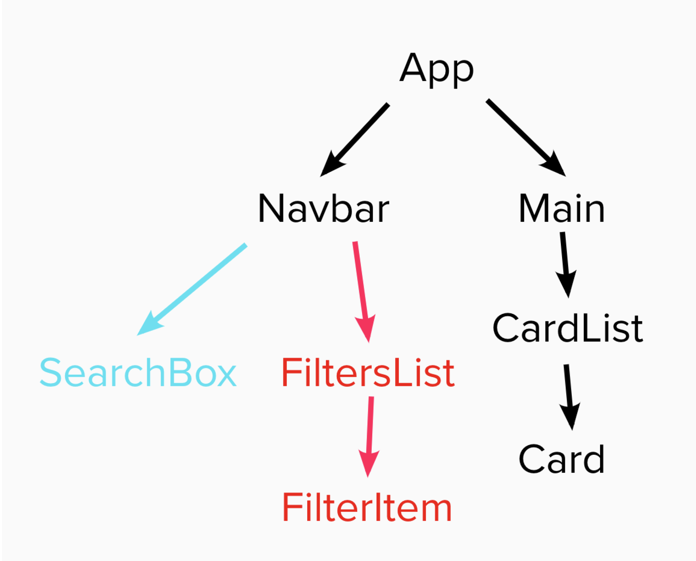
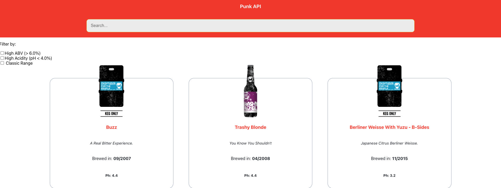
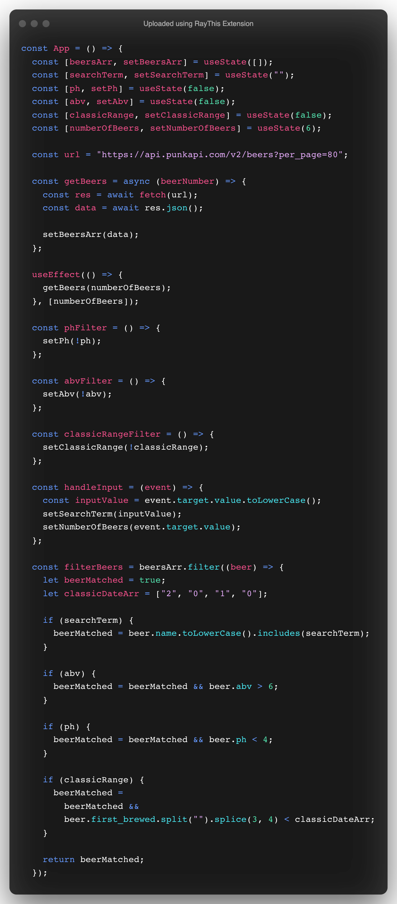

Punk API Project

Overview:

The task of this project was to build a website using React using data fetched from the Punk API.

The requirements:

• Must be built entirely in React,
• Must use the Punk API: <https://punkapi.com/>,
• Tested where possible with RTL,

The Spec:

The Design:

The Code:

